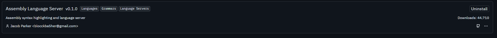

## On fedora:

### Rust
depencencies first:

`sudo dnf install curl gcc -y`

`curl --proto '=https' --tlsv1.2 -sSf https://sh.rustup.rs | sh`

-> rustc (compiler)

-> cargo (package manager)

-> rustup (toolchains manager)

### Golang

`curl -LO https://go.dev/dl/go1.25.5.linux-amd64.tar.gz`

`sudo rm -rf /usr/local/go`

`sudo tar -C /usr/local -xzf go1.25.5.linux-amd64.tar.gz`

### Gopls

`go install golang.org/x/tools/gopls@latest`

### asm-lsp
`cargo install asm-lsp`

Create `.asm-lsp.toml` with this:

```
# file for zed
[default_config]
version = "0.10.1"
assembler = "nasm"
instruction_set = "x86/x86-64"

[default_config.opts]
diagnostics = true
default_diagnostics = false

[[project]]
path = ""
version = "0.10.1"
assembler = "nasm"
instruction_set = "x86/x86-64"

[project.opts]
compiler = "nasm"
compile_flags_txt = [
    "-f",
    "elf64",
]
diagnostics = true
default_diagnostics = false
```

add on `~/.config/asm-lsp`

### gcc and clangd
`sudo dnf install clang clang-tools-extra -y`

`sudo dnf install gcc gcc-c++ gdb make -y`

ZSH:

```
cat << 'EOF' >> ~/.zshrc

# Go
export PATH="/usr/local/go/bin:$PATH"
export PATH="$(go env GOPATH)/bin:$PATH"

# Rust / Cargo (asm-lsp)
export PATH="$HOME/.cargo/bin:$PATH"
EOF
```

BASH:

```
cat << 'EOF' >> ~/.bashrc

# Go
export PATH="/usr/local/go/bin:$PATH"
export PATH="$(go env GOPATH)/bin:$PATH"

# Rust / Cargo (asm-lsp)
export PATH="$HOME/.cargo/bin:$PATH"
EOF
```

## Extentions 



